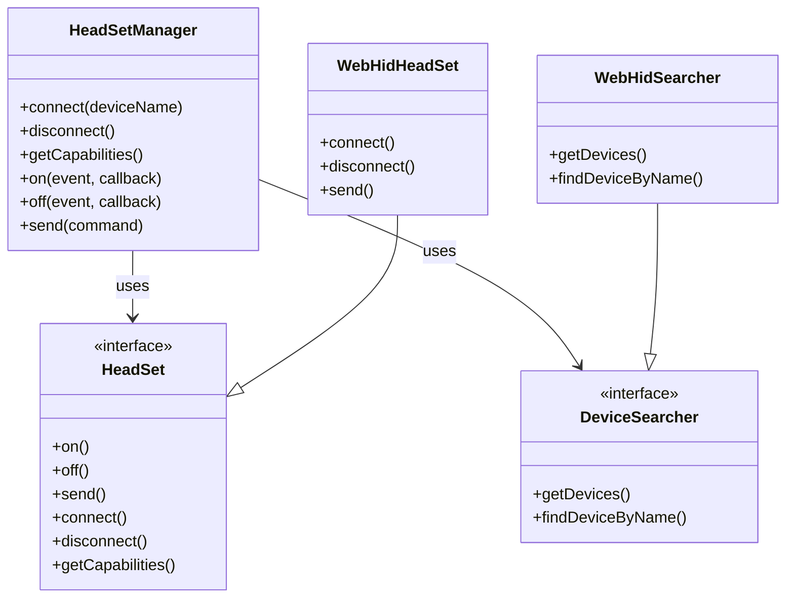

# headset-manager

TypeScript-библиотека для управления гарнитурами и спикерфонами через [WebHID API](https://developer.mozilla.org/en-US/docs/Web/API/WebHID_API). Позволяет искать устройства по имени, подключаться к ним, отправлять команды (mute/unmute, answer/reject) и получать события.

## Установка

```bash
npm install headset-manager
```

## Быстрый старт

```typescript
import { HeadSetManager, WebHidSearcher, errors } from 'headset-manager';

const searcher = new WebHidSearcher();
const manager = new HeadSetManager(searcher);

manager.on('inputreport', (payload) => console.log('Report:', payload));
manager.on('muted-mic', () => console.log('Muted'));

try {
  await manager.connect('Headset');
  const caps = manager.getCapabilities();
  await manager.send(new Uint8Array([0x01]));
  await manager.disconnect();
} catch (e) {
  if (errors.hasDeviceNotFoundError(e)) {
    console.error('Device not found');
  }
}
```

Перед подключением пользователь должен разрешить доступ к HID-устройству (например, через `navigator.hid.requestDevice()` в браузере).

## Демо

Запуск демо-страницы для ручной проверки:

```bash
npm run start
```

Откроется страница с полем ввода имени устройства, кнопками Find and Connect, Mute, Unmute, Answer, Reject, Get Capabilities и логом событий.

## API

### HeadSetManager

- **constructor(searcher)** — принимает реализацию поиска (например, `WebHidSearcher`).
- **connect(deviceName)** — подключается к устройству по имени (подстрока `productName`). Выбрасывает `DeviceNotFoundError`, если устройство не найдено.
- **disconnect()** — отключается от текущего устройства.
- **getCapabilities()** — возвращает объект возможностей (canMute, canAnswer, canReject, canHandleCall) или пустой объект, если устройство не подключено.
- **send(command)** — отправляет команду (Uint8Array, массив чисел или ArrayBuffer). Выбрасывает `OperationFailedError`, если устройство не подключено.
- **on(event, callback)** — подписка на событие.
- **off(event, callback)** — отписка от события.

События: `inputreport`, `muted-mic`, `unmuted-mic`, `incoming-call`, `call-answered`, `call-rejected`.

### WebHidSearcher

- **getDevices()** — список устройств, к которым уже предоставлен доступ.
- **findDeviceByName(name)** — поиск устройства по имени (подстрока в `productName`).
- **getHidDeviceByName(name)** — возвращает `HIDDevice` по имени (для внутреннего использования).

### Ошибки

- **DeviceNotFoundError** — устройство не найдено. Проверка: `errors.hasDeviceNotFoundError(error)`.
- **EventNotSupportedError** — событие не поддерживается.
- **DeviceDisconnectedError** — устройство отключено.
- **OperationFailedError** — ошибка операции (в т.ч. отсутствие WebHID или отсутствие подключённого устройства). Проверка: `errors.hasOperationFailedError(error)`.

## Поддержка браузеров

WebHID поддерживается в Chrome 89+, Edge 89+. В других браузерах API недоступен; при вызове методов, требующих `navigator.hid`, будет выброшена ошибка.

## Архитектура



## Лицензия

MIT
